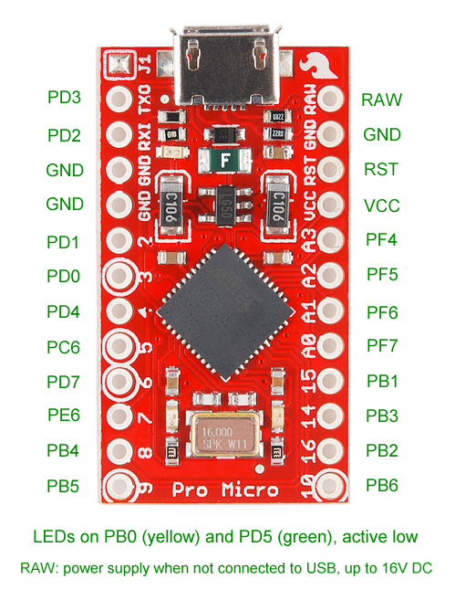

# ErgoDidact

Underside view of the KB left side connector:

Underside view of the KB right side connector:

Pin translation image for lulz:

### Arduino Pro Micro Pinout

| Rows        |  0 |  1 |  2 | 3   |
|-------------|----|----|----|-----|
| Arduino pin |  5 |  4 |  3 | TX0 |
| QMK pin     | C6 | D4 | D0 | D3  |

| Columns     | 0  | 1  | 2  | 3  |  4 |  5 |  6 |  7 |  8 |  9 | 10 | 11 |
|-------------|----|----|----|----|----|----|----|----|----|----|----|----|
| Arduino pin | A3 | A2 | A1 | A0 | 15 | 14 | 16 | 10 |  9 |  8 |  7 |  6 |
| QMK pin     | F4 | F5 | F6 | F7 | B1 | B3 | B2 | B6 | B5 | B4 | E6 | D7 |

|             | LED1 | LED2 |
|-------------|------|------|
| Arduino pin | N/A  | N/A  |
| QMK pin     | B0   | D5   |

### Compiling the Firmware

Make example for this keyboard (after setting up your build environment):

    make ergodidact:default:flash

### The Default Keymap

TODO: ... stuff!
